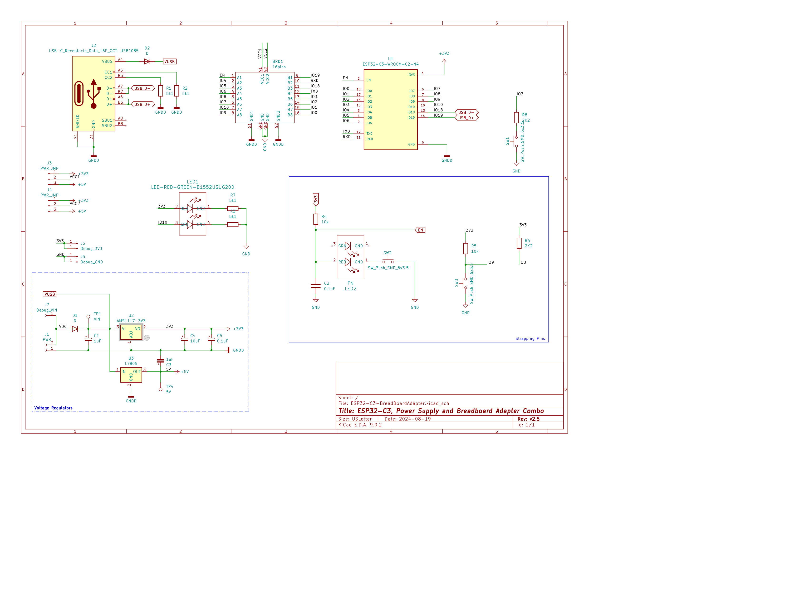
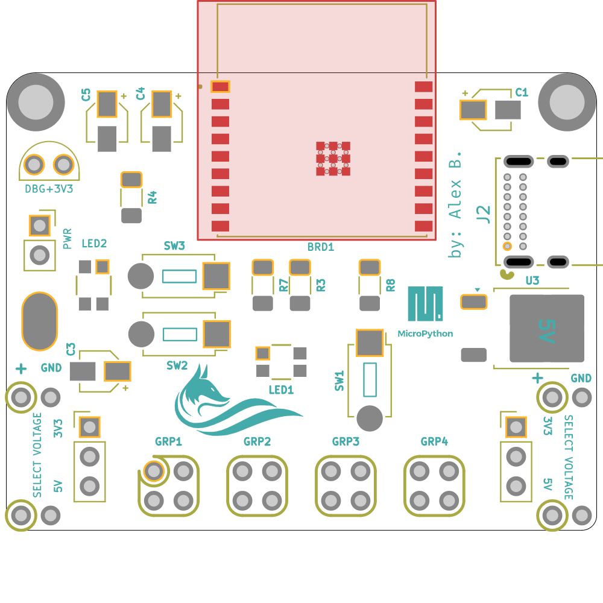

{{ page.title }}
================

<a href="assets/ESP32C3_Breadboard-Adapter_Schematic.pdf">Download ESP32-C3 Breadboard Development Board Schematic (PDF)</a>

|  Component  |  Value  |  Description  |  Details  |
|  ---  |  ---  |  ---  |  ---  |
| C1, C2  | 1uF  | Capacitor  |  |
| C4 | 10uF | Capacitor | SMD |
| C5 | 0.1uF | Capacitotr | SMD |
| R1, R2, R3, R7 | 5k1 | Resistor | SMD |
| R4, R5 | 10k | Resistor | SMD |
| R6, R8 | 2k2 | Resistor | SMD |
| D1, D2 | D | Diode | SMD |
| U1 | ESP32-C3-WROOM | ESP32 C3 Module | |
| U2 | AMS1117-3V3 | Voltage regulator 3.3V | [Datasheet: AMS1117](https://github.com/alexandrebobkov/ESP32-C3_Breadboard-Adapter/blob/main/assets/Voltage-Regulator_AMS1117.PDF) |
| U3 | L58M05 | Voltage regulator 5.0V | |
| SW1, SW2, SW3 | SW | Push switch | SW_PUSH_6x3.5mm |
| LED1 | RGB LED | Red, Green, Blue LED | SMD B1552USUG20D |
| LED2 | RED LED | Power LED | SMD B1552 |
| J2 | USB-C | USB 2.0 Type C power and data receptacle | [Datasheet: GCT USB4085 GF A](https://github.com/alexandrebobkov/ESP32-C3_Breadboard-Adapter/blob/main/assets/USB-C-usb4085.pdf)   Footprint | 

[home](index.md)
